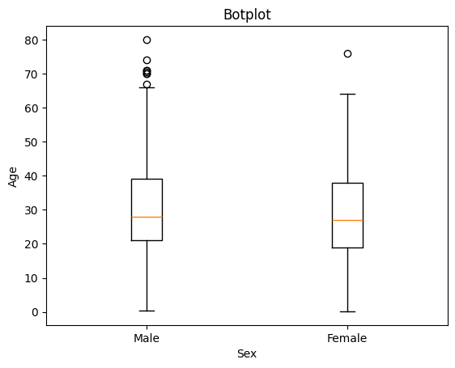

# __titanic_dataset__  
First step is preprocessing titanic dataset.  
[File](./titanic_descriptiveStatistics_boxPlot_standardNormalDistribution.ipynb)  
Create box-plot to compare different sex and ages.  
  
Calculate standard normal distribution and present the relationship between ages and frequency.  
  
Make three types of decision tree.  
Entropy  
[Entropy](./DecisionTree_tree_entropy.ipynb)  
  
Gini Impurity  
[Gini Impurity](./DecisionTree_tree_Gini.ipynb)  
  
Classification Error  
[Classification Error](./DecisionTree_log_loss.ipynb)  
  
